# Task Management API

A RESTful backend service for managing tasks and users, built with **Flask** and **SQLite**. Supports full CRUD operations, input validation, structured error handling, and a one-to-many relationship between users and their tasks.

> **Task 1 – Full-Stack Python Application (Backend Focus)**
> **Author:** Toheeb Olanrewaju Olagoke
> **Intern ID:** RDXINTTOHEWH86E

---
## Table of Contents

1. [Tech Stack](#tech-stack)
2. [Features](#features)
3. [Project Structure](#project-structure)
4. [Setup & Installation](#setup--installation)
5. [Database Schema](#database-schema)
6. [API Endpoints](#api-endpoints)
7. [Example Requests](#example-requests)
8. [Error Handling](#error-handling)
9. [Postman Testing](#postman-testing)
10. [Code Structure Explanation](#code-structure-explanation)

---

## Tech Stack

| Layer        | Technology              
| Language     | Python 3.10+ 
| Framework    | Flask 3.0                
| Database     | SQLite 3 
| Testing      | Postman 

---

## Features

- ✅ **Full CRUD** for tasks (Create, Read, Update, Delete)
- ✅ **User management** (Create users, list users)
- ✅ **One-to-many relationship**: each task belongs to a user
- ✅ **Input validation** with clear error messages
- ✅ **Robust error handling** with proper HTTP status codes
- ✅ **Parameterized SQL queries** (safe from SQL injection)
- ✅ **Foreign key constraints** enforced at the database level
- ✅ **Cascade delete**: removing a user deletes their tasks

---

## Project Structure

```
redynox-task1/
├── app.py                                  # Main Flask application + all routes
├── database.py                             # Database setup, connection, schema
├── requirements.txt                        # Python dependencies
├── tasks.db                                # SQLite database (auto-generated)
├── API_DOCS.md                             # Standalone API documentation
├── README.md                               # This file
├── .gitignore                              # Files to exclude from git
├── Task_Management_API.postman_collection.json   # Pre-configured Postman requests
└── screenshots/                            # Postman testing screenshots
    ├── 01-create-user.png
    ├── 02-get-users.png
    ├── 03-create-task.png
    ├── 04-create-second-task.png
    ├── 05-get-all-tasks.png
    ├── 06-get-one-task.png
    ├── 07-update-task.png
    ├── 08-user-tasks-relationship.png
    ├── 09-delete-task.png
    ├── 10-error-404.png
    ├── 11-error-validation.png
    └── 12-error-duplicate-email.png
```

---

## Setup & Installation

### Prerequisites

- Python 3.10 or higher
- pip (Python package manager)

### Steps

1. **Clone the repository**
   ```bash
   git clone https://github.com/<your-username>/redynox-task1.git
   cd redynox-task1
   ```

2. **(Optional) Create a virtual environment**
   ```bash
   python -m venv venv
   source venv/bin/activate   # On Windows: venv\Scripts\activate
   ```

3. **Install dependencies**
   ```bash
   pip install -r requirements.txt
   ```

4. **Run the application**
   ```bash
   python app.py
   ```

   You should see:
   ```
   ✅ Database ready (users + tasks).
   🚀 Task Management API is running at http://127.0.0.1:5000
   ```

5. **Test with Postman** — see [Postman Testing](#postman-testing) below.

---

## Database Schema

The database has two tables linked by a foreign key.

### `users` table

| Column      | Type      | Constraints                                |
|-------------|-----------|--------------------------------------------|
| id          | INTEGER   | PRIMARY KEY, AUTOINCREMENT                 |
| name        | TEXT      | NOT NULL                                   |
| email       | TEXT      | NOT NULL, UNIQUE                           |
| created_at  | DATETIME  | DEFAULT CURRENT_TIMESTAMP                  |

### `tasks` table

| Column      | Type      | Constraints                                |
|-------------|-----------|--------------------------------------------|
| id          | INTEGER   | PRIMARY KEY, AUTOINCREMENT                 |
| title       | TEXT      | NOT NULL                                   |
| description | TEXT      | DEFAULT ''                                 |
| status      | TEXT      | DEFAULT 'pending'                          |
| user_id     | INTEGER   | NOT NULL, FOREIGN KEY → users(id)          |
| created_at  | DATETIME  | DEFAULT CURRENT_TIMESTAMP                  |

### Relationship

```
   users (1)  ──────────  (many) tasks
   id        FK: user_id
```

One user can own many tasks. Deleting a user cascades and removes all their tasks (`ON DELETE CASCADE`).

---

## API Endpoints

**Base URL:** `http://127.0.0.1:5000`

### Task endpoints

| Method | Endpoint           | Description                  | Success Code |
|--------|--------------------|------------------------------|--------------|
| GET    | `/tasks`           | List all tasks               | 200          |
| GET    | `/tasks/<id>`      | Get a single task by ID      | 200          |
| POST   | `/tasks`           | Create a new task            | 201          |
| PUT    | `/tasks/<id>`      | Update an existing task      | 200          |
| DELETE | `/tasks/<id>`      | Delete a task                | 200          |

### User endpoints

| Method | Endpoint                  | Description                    | Success Code |
|--------|---------------------------|--------------------------------|--------------|
| POST   | `/users`                  | Create a new user              | 201          |
| GET    | `/users`                  | List all users                 | 200          |
| GET    | `/users/<id>/tasks`       | List all tasks for a user ⭐   | 200          |

---

## Example Requests

### Create a user

**Request**
```http
POST /users
Content-Type: application/json

{
  "name": "Toheeb",
  "email": "toheeb@example.com"
}
```

**Response — 201 Created**
```json
{
  "success": true,
  "message": "User created!",
  "user": {
    "id": 1,
    "name": "Toheeb",
    "email": "toheeb@example.com",
    "created_at": "2026-05-13 22:41:22"
  }
}
```

### Create a task

**Request**
```http
POST /tasks
Content-Type: application/json

{
  "title": "Learn Flask",
  "description": "Complete the tutorial",
  "user_id": 1
}
```

**Response — 201 Created**
```json
{
  "success": true,
  "message": "Task created!",
  "task": {
    "id": 1,
    "title": "Learn Flask",
    "description": "Complete the tutorial",
    "status": "pending",
    "user_id": 1,
    "created_at": "2026-05-13 22:41:29"
  }
}
```

### Update a task

**Request**
```http
PUT /tasks/1
Content-Type: application/json

{
  "status": "completed"
}
```

**Response — 200 OK**
```json
{
  "success": true,
  "message": "Task updated!",
  "task": {
    "id": 1,
    "title": "Learn Flask",
    "description": "Complete the tutorial",
    "status": "completed",
    "user_id": 1,
    "created_at": "2026-05-13 22:41:29"
  }
}
```

### Get a user's tasks (relationship in action)

**Request**
```http
GET /users/1/tasks
```

**Response — 200 OK**
```json
{
  "success": true,
  "user": {
    "id": 1,
    "name": "Toheeb",
    "email": "toheeb@example.com",
    "created_at": "2026-05-13 22:41:22"
  },
  "tasks": [
    {
      "id": 1,
      "title": "Learn Flask",
      "status": "completed",
      "user_id": 1
    }
  ],
  "count": 1
}
```

### Status values

The `status` field on a task accepts one of:
- `pending` (default)
- `in_progress`
- `completed`

---

## Error Handling

All errors return a consistent JSON shape with an appropriate HTTP status code.

| Status | Meaning                            | Example trigger                                  |
|--------|------------------------------------|--------------------------------------------------|
| 400    | Bad Request — invalid input        | Missing `title` on POST, invalid `status` value  |
| 404    | Not Found                          | `GET /tasks/9999` when no such task exists       |
| 500    | Internal Server Error              | Unexpected exception                             |

### Error response examples

**Validation error (400)**
```json
{
  "success": false,
  "errors": [
    "Title is required and cannot be empty.",
    "user_id is required."
  ]
}
```

**Not found (404)**
```json
{
  "success": false,
  "error": "Task with ID 9999 not found."
}
```

**Duplicate email (400)**
```json
{
  "success": false,
  "error": "Email already exists."
}
```

---

## Postman Testing

A pre-configured Postman collection (`Task_Management_API.postman_collection.json`) is included. Import it into Postman to get all 12 test requests ready to run.

### Test results

All 12 test scenarios passed. Server log:

```
POST   /users          → 201   ✅ Create user
GET    /users          → 200   ✅ List users
POST   /tasks          → 201   ✅ Create task
POST   /tasks          → 201   ✅ Create second task
GET    /tasks          → 200   ✅ List all tasks
GET    /tasks/1        → 200   ✅ Get one task
PUT    /tasks/1        → 200   ✅ Update task
GET    /users/1/tasks  → 200   ✅ Relationship endpoint
DELETE /tasks/2        → 200   ✅ Delete task
GET    /tasks/9999     → 404   ✅ Error: not found
POST   /tasks          → 400   ✅ Error: missing title
POST   /users          → 400   ✅ Error: duplicate email
```

### Screenshots

| # | Test                        | Screenshot                                       |
|---|-----------------------------|--------------------------------------------------|
| 1 | Create user                 | 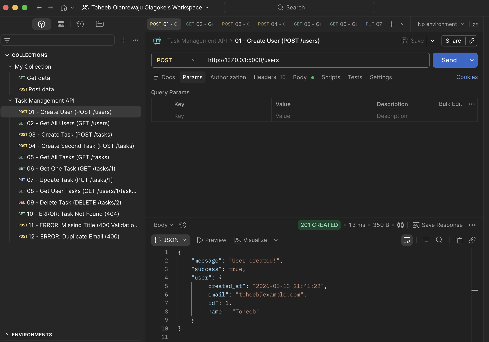              |
| 2 | Get all users               | 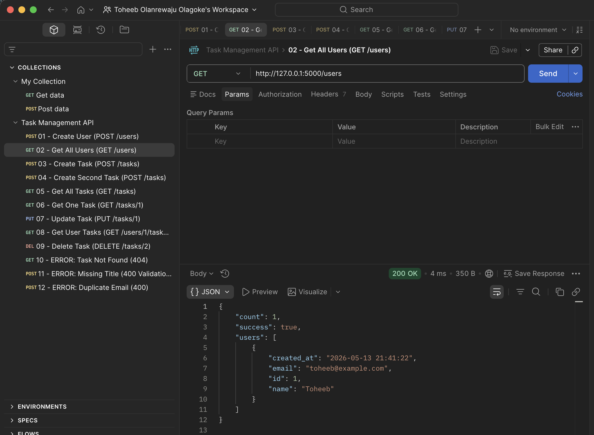                |
| 3 | Create task                 | 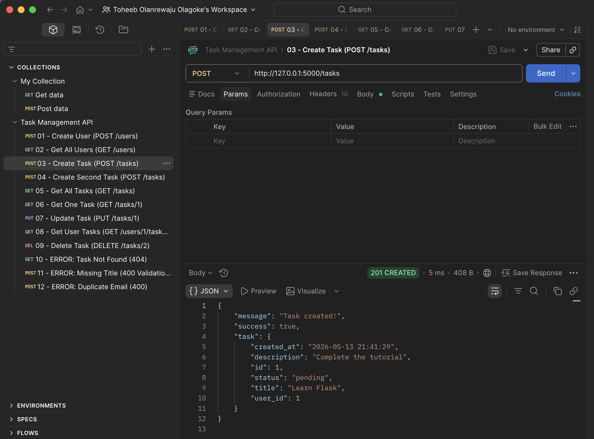              |
| 4 | Create second task          | 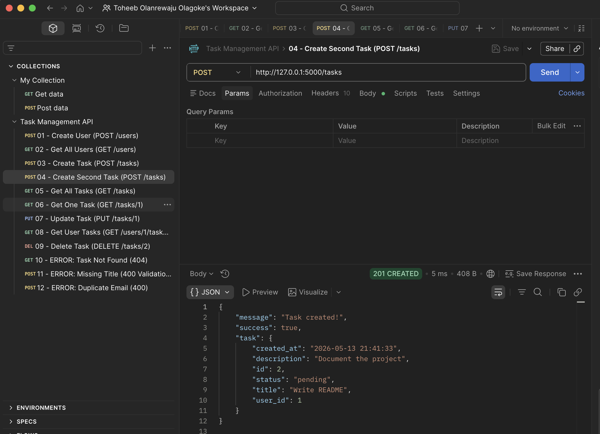      |
| 5 | Get all tasks               | 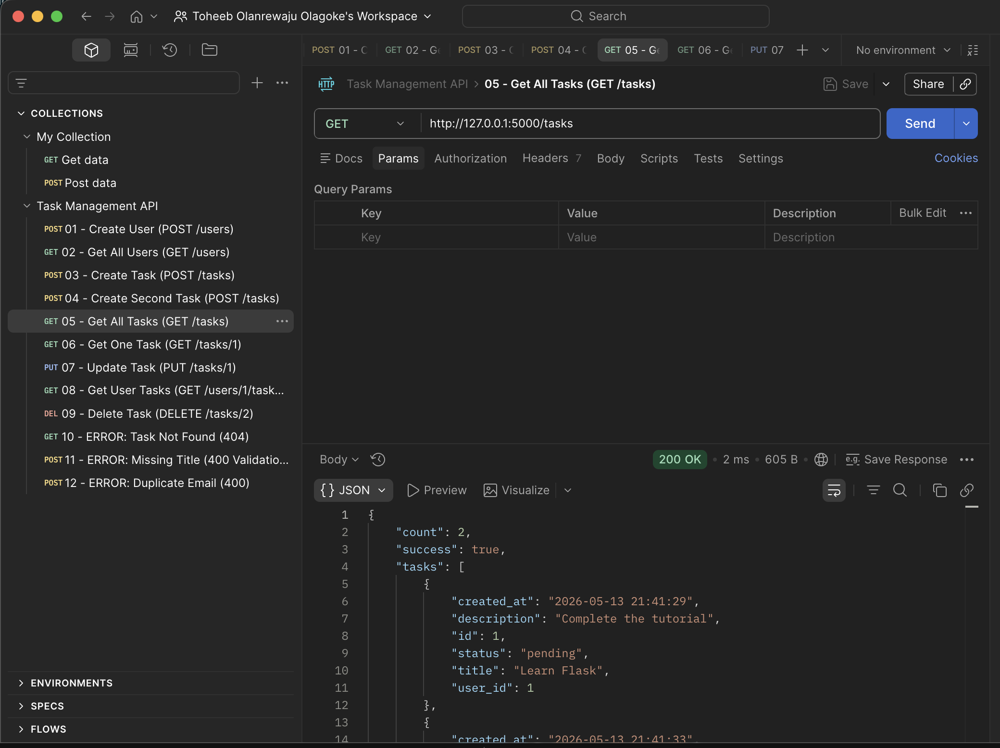            |
| 6 | Get one task                | 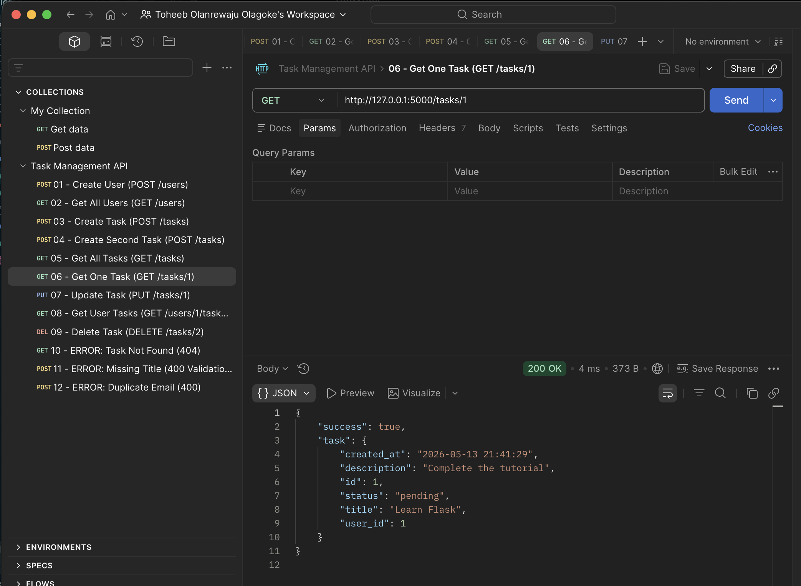             |
| 7 | Update task                 | 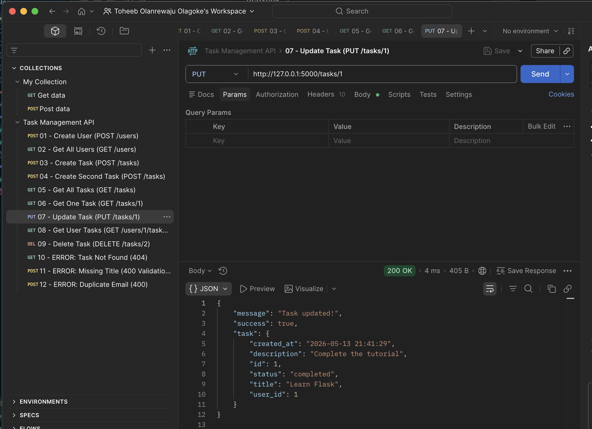              |
| 8 | User's tasks (relationship) | 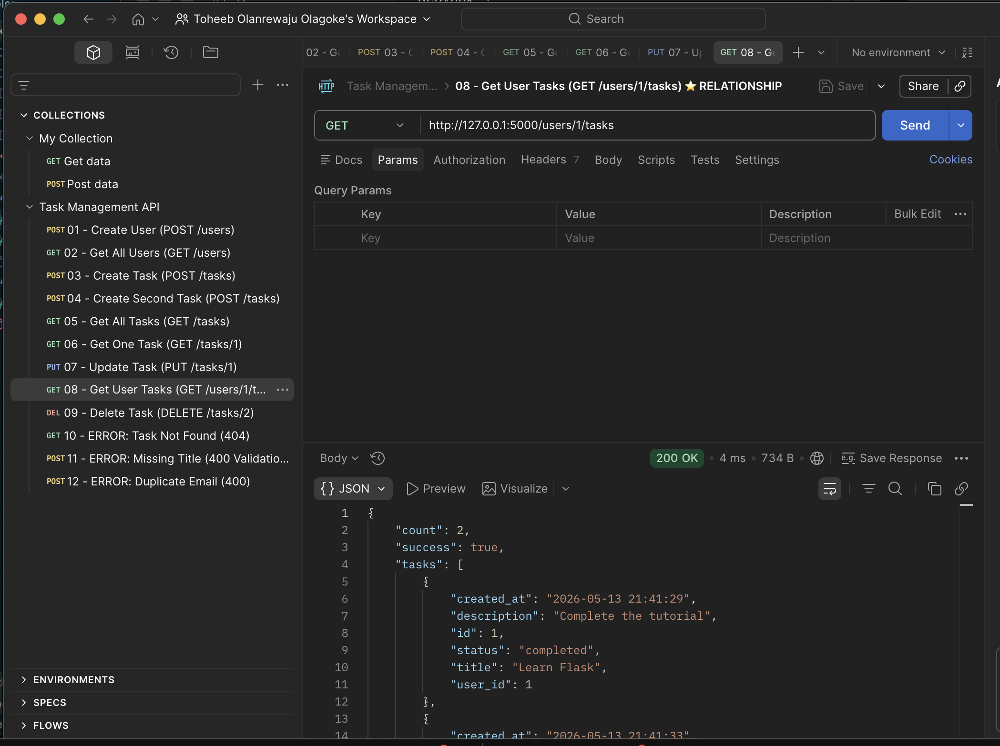 |
| 9 | Delete task                 | 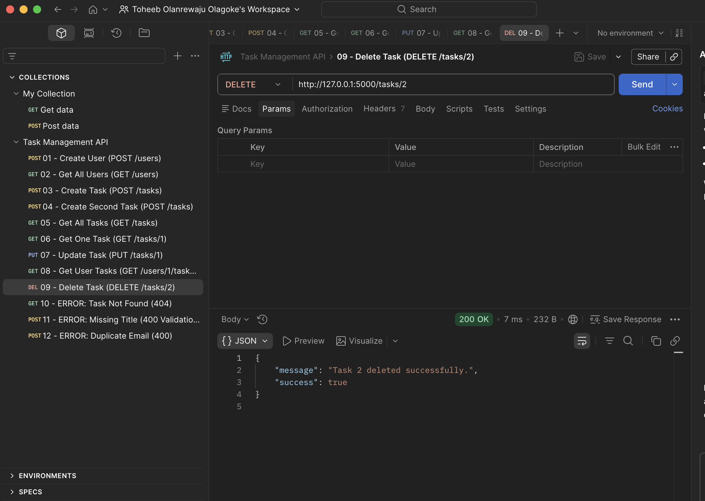              |
| 10 | Error: 404 not found       | 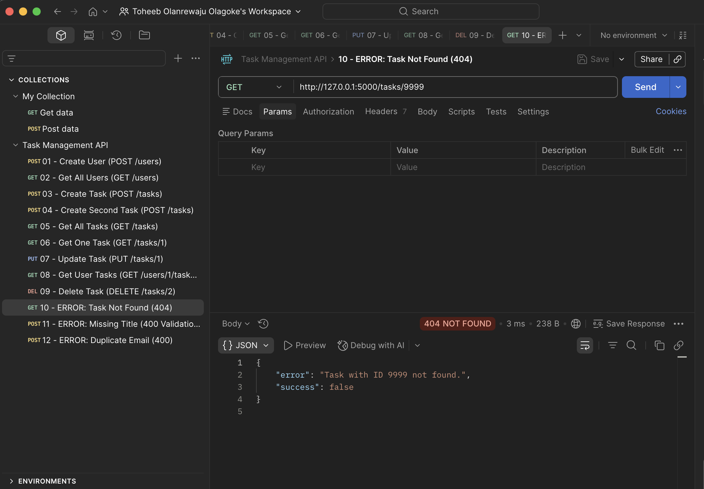                |
| 11 | Error: validation (400)    | 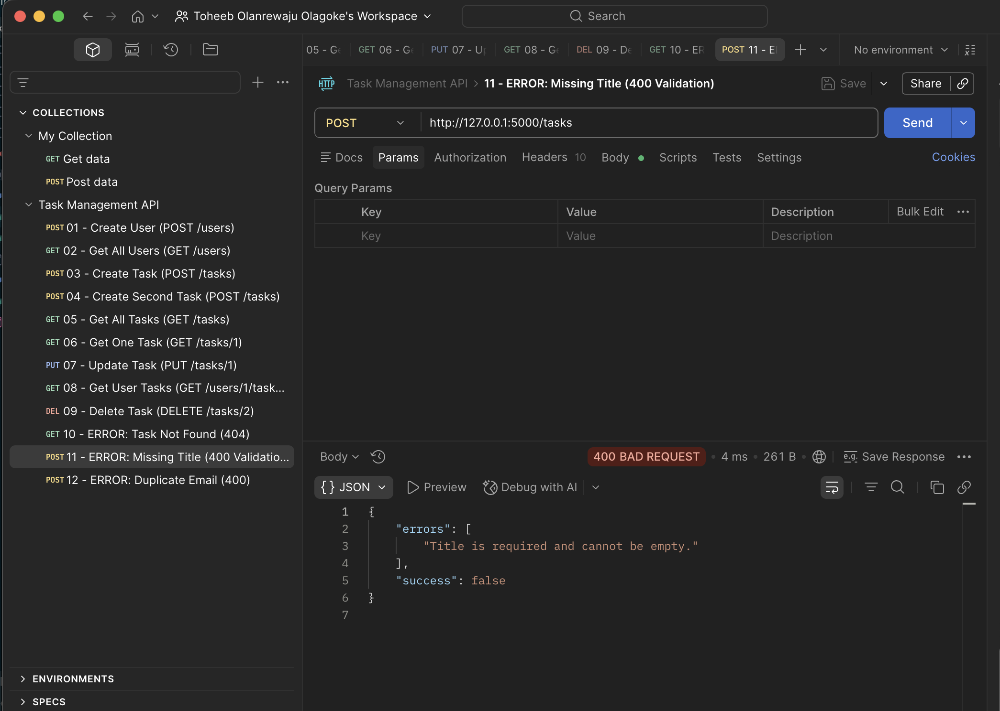         |
| 12 | Error: duplicate email     | 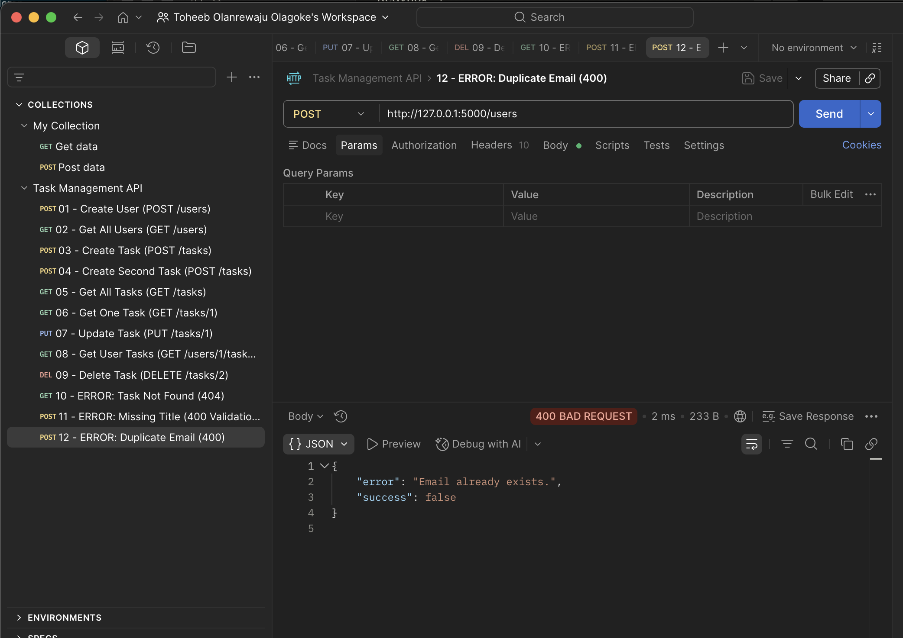    |

---

## Code Structure Explanation

The project is intentionally compact but follows clear separation of concerns.

### `database.py`
Handles **everything related to the database** — opening connections, enforcing foreign keys, and creating the `users` and `tasks` tables on startup. The `get_db_connection()` function is reused by every route. Keeping DB code in its own file means the route handlers in `app.py` only have to worry about HTTP logic, not database setup.

### `app.py`
The **main application file**. Organised into clear sections:

1. **App setup** — create the Flask app, initialize the database
2. **Validation helpers** — `validate_task()` and `validate_user()` centralise input checking, returning a list of error messages
3. **Task routes** — five endpoints implementing full CRUD over the `tasks` table
4. **User routes** — three endpoints for user management and the relationship endpoint
5. **Home route** — a welcome page listing all available endpoints
6. **Run block** — starts the dev server when the file is executed directly

### Design choices

- **Parameterized queries everywhere.** All SQL uses `?` placeholders, never string concatenation. This protects the API from SQL injection.
- **Validation before DB access.** Every POST/PUT validates input first, so the database is never hit with bad data.
- **User existence is checked on task creation.** The `POST /tasks` handler verifies the `user_id` exists in the `users` table before inserting a new task, returning 404 if not. This means orphan tasks can never be created.
- **Consistent JSON response shape.** Every response includes a `success` boolean, plus either the data or an error message, making it easy for any client to parse.
- **Try/except around every route.** Any unhandled exception is caught and returned as a 500 with a JSON error body rather than Flask's default HTML error page.

---

## Requirements (`requirements.txt`)

```
flask==3.0.0
```

---

## License

This project was created for the Redynox internship program (Task 1).
