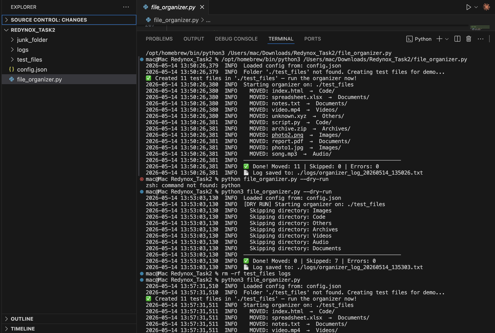
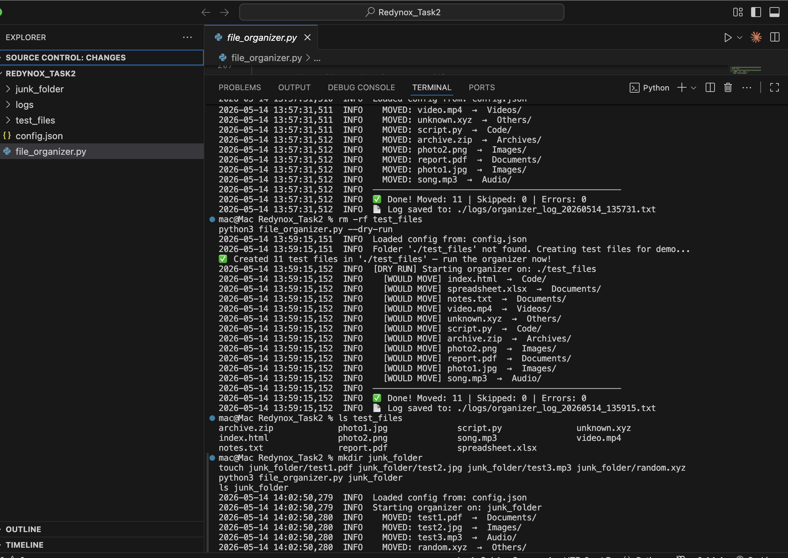
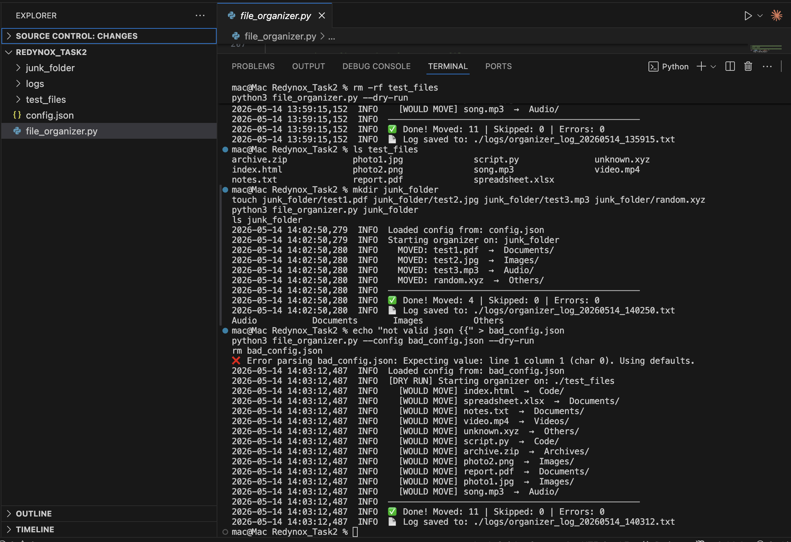
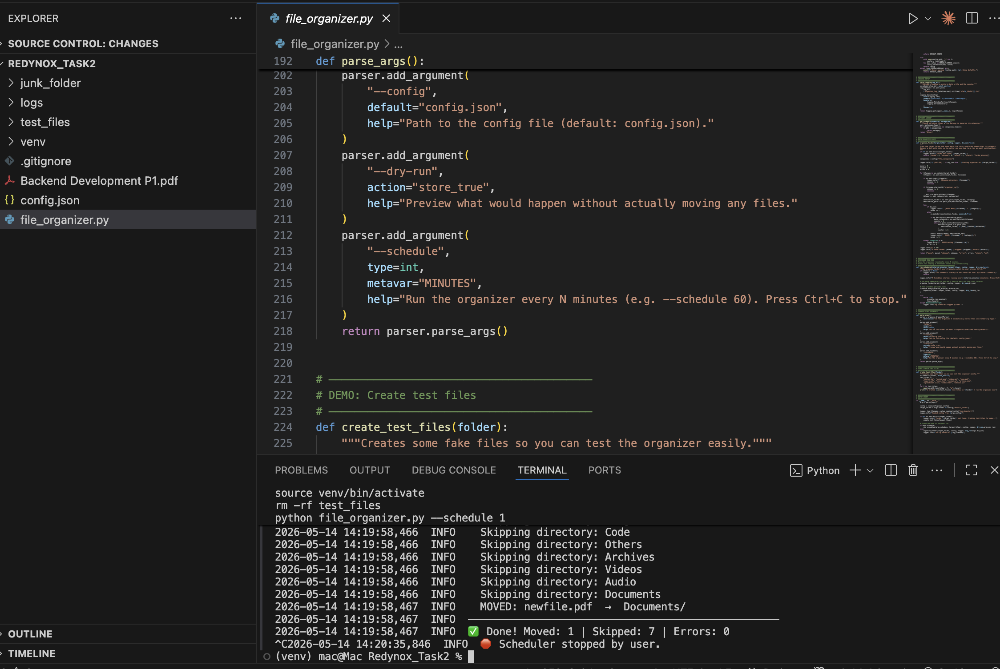
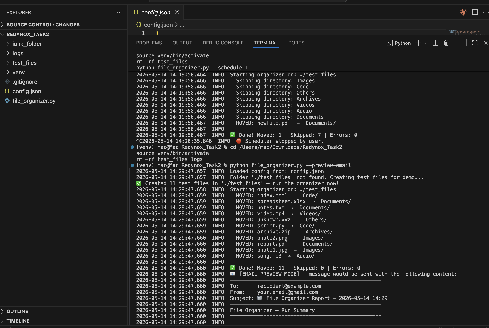
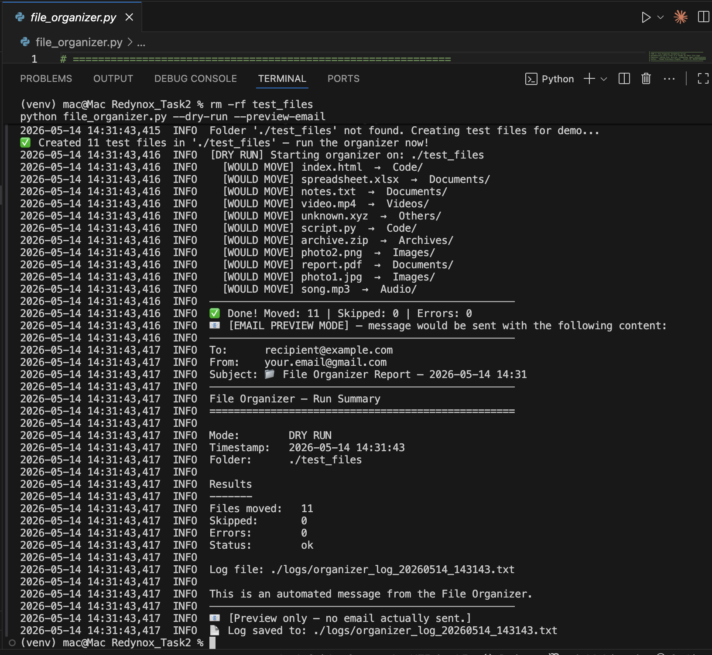
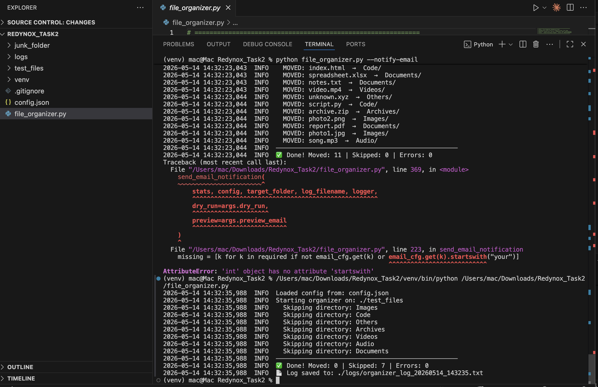
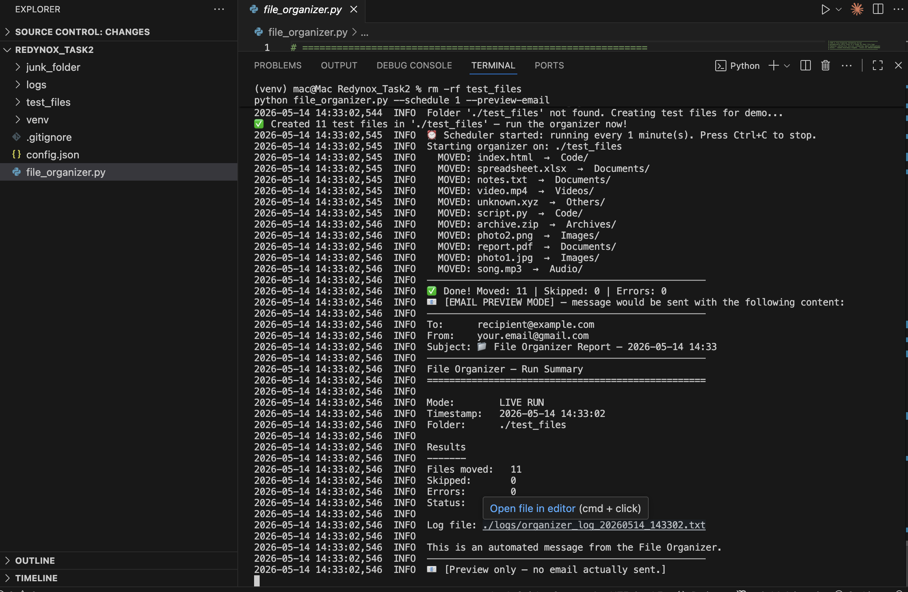
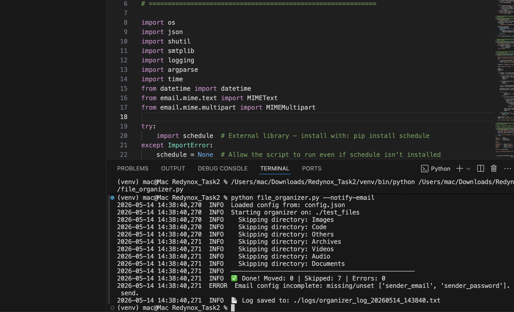

# 📁 File Organizer — Automation Script

A robust, configurable Python automation tool that **automatically sorts files into category folders** based on their file extensions. Built to solve a real, repetitive problem: messy Downloads folders that fill up with mixed files (photos, PDFs, ZIPs, scripts, etc.) and never get tidied up.

> **Task 2 – Automation Script for Real-World Problem**
> **Author:** Toheeb Olanrewaju Olagoke
> **Intern ID:** RDXINTTOHEWH86E

---

## 📋 Table of Contents

1. [Problem Statement](#-problem-statement)
2. [Solution Approach](#-solution-approach)
3. [Features](#-features)
4. [Tech Stack](#-tech-stack)
5. [Project Structure](#-project-structure)
6. [Setup & Installation](#-setup--installation)
7. [Configuration](#-configuration)
8. [Usage](#-usage)
9. [Scheduling](#-scheduling)
10. [Email Notifications](#-email-notifications)
11. [Demonstration Results](#-demonstration-results)
12. [Code Structure Explanation](#-code-structure-explanation)
13. [Error Handling](#-error-handling)

---

## 🎯 Problem Statement

Most people accumulate dozens — sometimes hundreds — of files in their **Downloads**, **Desktop**, or any shared work folder over time. These files come from different sources and in different formats: photos, videos, PDFs, ZIPs, source code, spreadsheets, and miscellaneous one-offs.

Manually sorting them is tedious and easy to forget. The result is:
- ❌ Important files get buried under junk
- ❌ Disk space fills up without anyone noticing
- ❌ Finding anything specific takes minutes
- ❌ No one has the time to do it manually, every day

**The goal:** an automation tool that watches a folder and silently keeps it organised — running once, on demand, or on a schedule — with clear logging and optional notifications so users always know what happened.

---

## 💡 Solution Approach

A single Python script (`file_organizer.py`) that:

1. **Reads its settings from a JSON config file** so users can customise categories without touching code.
2. **Scans the target folder**, identifies each file's extension, and moves it into a matching subfolder (`Images/`, `Documents/`, `Code/`, etc.).
3. **Falls back gracefully** when anything is missing — no config file, a malformed config, a non-existent target folder, etc.
4. **Supports a dry-run mode** so users can preview changes before committing to them.
5. **Can be scheduled** either with the built-in `--schedule` flag, with cron (Mac/Linux), or with Task Scheduler (Windows).
6. **Sends an email summary** when each run completes (with a preview mode for demos).
7. **Logs everything** to a timestamped file in `./logs/` for full traceability.

Design priorities: **safe defaults, clear logging, graceful failure, zero surprises.**

---

## ✨ Features

- ✅ **Configurable categories** via `config.json` (add/remove extensions without editing code)
- ✅ **Dry-run mode** — preview moves before committing
- ✅ **Duplicate-name handling** — auto-renames to `file_1.ext`, `file_2.ext`, etc.
- ✅ **Built-in scheduler** — `--schedule N` runs every N minutes
- ✅ **External scheduling support** — works with cron and Windows Task Scheduler
- ✅ **Email notifications** — summary email after each run (with preview mode)
- ✅ **Comprehensive logging** — timestamped files in `./logs/`
- ✅ **CLI arguments** — `argparse`-powered, easy to use
- ✅ **Auto-creates demo files** if the target folder doesn't exist
- ✅ **Graceful error handling** — invalid configs, missing folders, bad credentials all handled

---

## 🛠 Tech Stack

| Layer        | Technology                                |
|--------------|-------------------------------------------|
| Language     | Python 3.10+                              |
| Standard lib | `os`, `shutil`, `json`, `logging`, `argparse`, `smtplib` |
| External lib | `schedule` (for built-in scheduler)       |
| Scheduling   | Built-in loop, cron, Windows Task Scheduler |

---

## 📂 Project Structure

```
Redynox_Task2/
├── file_organizer.py             # Main automation script
├── config.json                   # User-editable settings (categories, paths, email)
├── requirements.txt              # Python dependencies
├── README.md                     # This file
├── .gitignore                    # Files to exclude from git
├── logs/                         # Timestamped log files (auto-generated)
│   └── organizer_log_*.txt
├── test_files/                   # Demo folder (auto-generated on first run)
└── screenshots/                  # Demo screenshots for this report
    ├── 01-normal-run.png
    ├── 02-dry-run.png
    ├── 03-dry-run-verification.png
    ├── 04-custom-folder.png
    ├── 05-bad-config-fallback.png
    ├── 06-scheduler-newfile-detected.png
    ├── 07-email-preview-live.png
    ├── 08-email-preview-dryrun.png
    └── 09-email-missing-config.png
```

---

## 🚀 Setup & Installation

### Prerequisites

- Python 3.10 or higher
- pip

### Steps

1. **Clone the repository**
   ```bash
   git clone https://github.com/<your-username>/Redynox_Task2.git
   cd Redynox_Task2
   ```

2. **Create a virtual environment** (recommended)
   ```bash
   python3 -m venv venv
   source venv/bin/activate          # macOS / Linux
   # OR
   venv\Scripts\activate             # Windows
   ```

3. **Install dependencies**
   ```bash
   pip install -r requirements.txt
   ```

4. **Run the script** (a demo `test_files/` folder is auto-created on first run)
   ```bash
   python file_organizer.py
   ```

---

## ⚙️ Configuration

All settings live in `config.json`. You can edit this file to add categories, change paths, or wire up email — **without touching the Python code.**

```json
{
  "file_categories": {
    "Images":    [".jpg", ".jpeg", ".png", ".gif"],
    "Videos":    [".mp4", ".mov", ".avi"],
    "Documents": [".pdf", ".docx", ".txt"],
    "Code":      [".py", ".js", ".html"],
    "Archives":  [".zip", ".tar", ".gz"]
  },
  "default_folder": "./test_files",
  "log_directory": "./logs",
  "email": {
    "enabled": false,
    "smtp_server": "smtp.gmail.com",
    "smtp_port": 587,
    "sender_email": "your.email@gmail.com",
    "sender_password": "your-gmail-app-password",
    "recipient_email": "recipient@example.com"
  }
}
```

Anything not listed in `file_categories` is automatically routed to an `Others/` folder.

---

## 🖥 Usage

### Basic run

```bash
python file_organizer.py
```

Uses `default_folder` from `config.json` (defaults to `./test_files`).

### Organize a custom folder

```bash
python file_organizer.py ~/Downloads
```

### Preview without moving anything (dry-run)

```bash
python file_organizer.py ~/Downloads --dry-run
```

### Use a different config file

```bash
python file_organizer.py --config my_config.json
```

### Full CLI reference

| Flag                 | Description                                                  |
|----------------------|--------------------------------------------------------------|
| `folder`             | Target folder to organize (positional, overrides config)     |
| `--config PATH`      | Path to config file (default: `config.json`)                 |
| `--dry-run`          | Preview moves without actually moving files                  |
| `--schedule N`       | Run every N minutes (uses the `schedule` library)            |
| `--notify-email`     | Send an email summary after each run                         |
| `--preview-email`    | Print the email to console instead of sending (demo mode)    |
| `-h`, `--help`       | Show full CLI help                                           |

---

## ⏰ Scheduling

The organizer supports three scheduling options:

### Option 1 — Built-in scheduler

```bash
python file_organizer.py --schedule 60
```

Runs every 60 minutes until you press Ctrl+C. Best for development and short-running automation. Uses Python's `schedule` library.

### Option 2 — cron (macOS / Linux)

Open the cron table:
```bash
crontab -e
```

Add a line like this to run the organizer on your `Downloads` folder every day at 6 PM:

```cron
0 18 * * * cd /Users/mac/Downloads/Redynox_Task2 && /Users/mac/Downloads/Redynox_Task2/venv/bin/python file_organizer.py ~/Downloads >> /Users/mac/Downloads/Redynox_Task2/logs/cron.log 2>&1
```

cron format reminder: `minute hour day-of-month month day-of-week`. Example variations:
- `0 * * * *` — every hour on the hour
- `*/30 * * * *` — every 30 minutes
- `0 9 * * 1-5` — every weekday at 9 AM

### Option 3 — Windows Task Scheduler

1. Open **Task Scheduler** from the Start menu
2. Click **Create Basic Task** → name it "File Organizer"
3. Trigger: choose **Daily** (or your preferred frequency)
4. Action: **Start a program**
5. Program: `python` (or full path to `python.exe`)
6. Arguments: `C:\path\to\file_organizer.py C:\Users\<you>\Downloads`
7. Save, and Windows will run it on your schedule automatically.

---

## 📧 Email Notifications

The organizer can send an email summary after each run. To avoid requiring real SMTP credentials for testing, a **preview mode** is included that prints the email to the console instead of sending it.

### Preview mode (no setup required)

```bash
python file_organizer.py --preview-email
```

Output:
```
📧 [EMAIL PREVIEW MODE] — message would be sent with the following content:
──────────────────────────────────────────────────
To:      recipient@example.com
From:    your.email@gmail.com
Subject: 📁 File Organizer Report — 2026-05-14 14:29
──────────────────────────────────────────────────
File Organizer — Run Summary
==================================================

Mode:        LIVE RUN
Timestamp:   2026-05-14 14:29:47
Folder:      ./test_files

Results
-------
Files moved:   11
Skipped:       0
Errors:        0
Status:        ok
...
```

### Live mode (real Gmail setup)

1. In Google Account settings, enable **2-Factor Authentication**.
2. Generate an **App Password** for "Mail" → copy the 16-character password.
3. Edit `config.json`:
   ```json
   "email": {
     "enabled": true,
     "smtp_server": "smtp.gmail.com",
     "smtp_port": 587,
     "sender_email": "your.real.email@gmail.com",
     "sender_password": "abcd efgh ijkl mnop",
     "recipient_email": "where.to.send@gmail.com"
   }
   ```
4. Run:
   ```bash
   python file_organizer.py --notify-email
   ```

If any credential is missing or unset, the script logs a clear error and continues without crashing.

### Combine scheduling with email

```bash
python file_organizer.py --schedule 60 --notify-email
```

Sends a summary email every hour after the organizer runs.

---

## 🧪 Demonstration Results

The script was tested against multiple scenarios. Each test was captured with a screenshot.

### Test 1 — Normal run (organizes 11 demo files)

```bash
python file_organizer.py
```

All 11 files moved into 7 category folders. ✅



### Test 2 — Dry-run (preview only)

```bash
python file_organizer.py --dry-run
```

11 files identified, but none moved (no subfolders created). ✅



### Test 3 — Dry-run verification

```bash
ls test_files
```

Confirms that dry-run made zero changes — all 11 files still flat in `test_files/`. ✅



### Test 4 — Custom target folder

```bash
mkdir junk_folder
touch junk_folder/test1.pdf junk_folder/test2.jpg junk_folder/test3.mp3 junk_folder/random.xyz
python file_organizer.py junk_folder
```

Successfully organizes a different folder. Unknown extension `.xyz` correctly routed to `Others/`. ✅



### Test 5 — Bad config file (graceful fallback)

```bash
echo "not valid json {{" > bad_config.json
python file_organizer.py --config bad_config.json --dry-run
```

Script detects the JSON parse error, logs it, and falls back to built-in defaults. ✅



### Test 6 — Scheduler picks up new file mid-run

```bash
python file_organizer.py --schedule 1
# In another terminal: touch test_files/newfile.pdf
```

After the first scheduled tick, the script detects `newfile.pdf` and moves it to `Documents/`. **This proves the automation works in real-world conditions.** ✅



### Test 7 — Email preview (live run)

```bash
python file_organizer.py --preview-email
```

Email body shows `Mode: LIVE RUN` with full statistics. ✅



### Test 8 — Email preview (dry-run)

```bash
python file_organizer.py --dry-run --preview-email
```

Email body correctly shows `Mode: DRY RUN`. ✅



### Test 9 — Email with missing credentials (graceful error)

```bash
python file_organizer.py --notify-email
```

Script detects placeholder credentials and exits cleanly with a clear error message instead of crashing. ✅



### Summary

| Test | Scenario                           | Result   |
|------|------------------------------------|----------|
| 1    | Normal run                         | ✅ 11 files moved |
| 2    | Dry-run                            | ✅ 0 files moved (preview only) |
| 3    | Dry-run side-effect verification   | ✅ Folder unchanged |
| 4    | Custom folder                      | ✅ 4 files moved |
| 5    | Malformed config                   | ✅ Graceful fallback |
| 6    | Scheduler detects new file         | ✅ File moved on next tick |
| 7    | Email preview (live)               | ✅ Email body rendered |
| 8    | Email preview (dry-run)            | ✅ Mode labelled correctly |
| 9    | Email with missing credentials     | ✅ Clean error, no crash |

**9 / 9 scenarios passed.**

---

## 🧱 Code Structure Explanation

The script is organised into clearly-separated functional sections:

### 1. `load_config()`
Reads `config.json`, falls back to `DEFAULT_CONFIG` if the file is missing or malformed. Fills in any missing keys with defaults so the rest of the script never crashes on a partial config.

### 2. `setup_logging()`
Creates the `logs/` directory if it doesn't exist and configures Python's `logging` module to write to **both** a timestamped log file AND the console. The `force=True` flag ensures logging can be reconfigured on repeated runs.

### 3. `get_category()`
Pure helper function — given an extension and the category map, returns the matching category name (or `"Others"` for unknown extensions).

### 4. `organize_folder()`
The core logic. Iterates over every item in the target folder, classifies each file, handles duplicate filenames, performs the move (or simulates it in dry-run mode), and returns a `stats` dict that the email notifier can use.

### 5. `build_email_body()` + `send_email_notification()`
Two-stage email logic:
- `build_email_body()` composes the message text from run statistics
- `send_email_notification()` either prints it to console (preview mode) or sends it via SMTP (live mode), with full credential validation before attempting to connect

### 6. `run_scheduled()`
Wraps the organizer in a `schedule.every(...).do(...)` loop. Inner `job()` function combines an organize-and-notify cycle so the scheduler can trigger email after every run.

### 7. `parse_args()`
All CLI flags defined in one place using `argparse`. Each flag has clear help text shown by `--help`.

### 8. Entry-point block (`if __name__ == "__main__"`)
Orchestrates the whole flow: parse args → load config → set up logging → ensure target folder exists → run organizer (one-shot or scheduled) → send email if requested.

### Design principles followed

- **Single responsibility per function** — each function does one thing
- **Pure functions where possible** — `get_category`, `build_email_body` are deterministic
- **Stats returned, not printed** — `organize_folder` returns a dict, the caller decides what to do with it
- **Defensive defaults** — every external dependency (config, schedule library, SMTP credentials) has a fallback
- **Logging over print** — uniform, timestamped, and saved to disk

---

## 🛡 Error Handling

The script is designed to never crash on user error. Every external dependency is wrapped:

| Failure Case                        | How It's Handled                                |
|-------------------------------------|-------------------------------------------------|
| Missing `config.json`               | Falls back to `DEFAULT_CONFIG`, prints warning  |
| Malformed JSON in config            | Catches `JSONDecodeError`, falls back to defaults |
| Missing target folder               | Auto-creates test files for demo                |
| `schedule` library not installed    | Disables `--schedule` with a clear error        |
| Missing email credentials           | Logs error, skips send, continues normally      |
| SMTP server unreachable             | Caught by try/except, logged, run still succeeds |
| File move fails (permissions, etc.) | Per-file try/except, counted as error, continues with next file |
| Duplicate filename in destination   | Auto-appends `_1`, `_2`, etc.                   |

---

## 📦 Requirements (`requirements.txt`)

```
schedule==1.2.2
```

All other dependencies are part of Python's standard library.

---

## 📜 License

Created for the Redynox internship program (Task 2).
